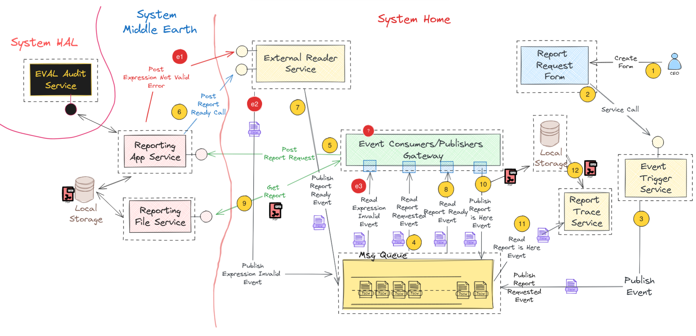
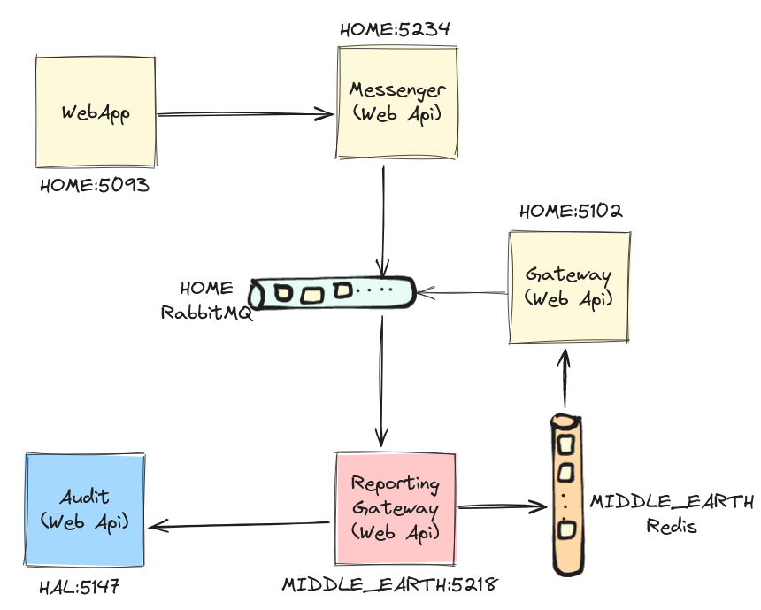
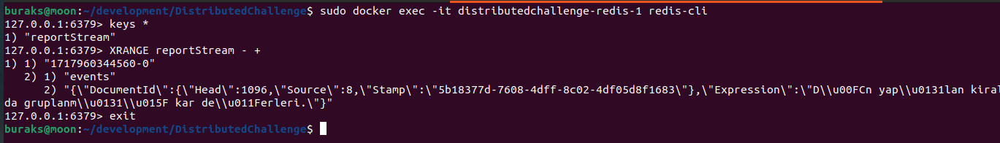
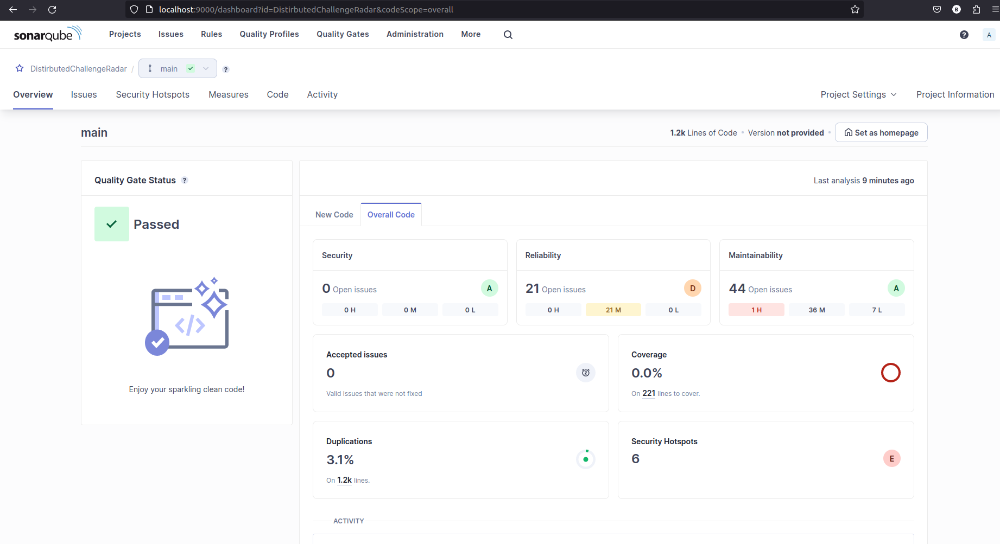
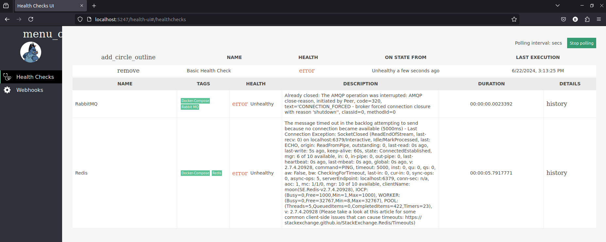
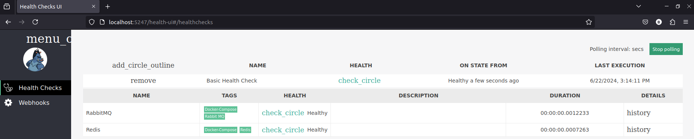

# Distributed Challenge

Bu repoda asenkron mesaj kuyruklarını hedef alan bir dağıtık sistem problemi oluşturmaya ve bu problemin çözümünü uygulamaya çalışıyorum.

- [Distributed Challenge](#distributed-challenge)
  - [Geliştirme Ortamı](#geliştirme-ortamı)
  - [Senaryo](#senaryo)
  - [Aday Çözüm](#aday-çözüm)
  - [Envanter](#envanter)
    - [Baş Ağrıtacak Dayanıklılık Senaryoları](#baş-ağrıtacak-dayanıklılık-senaryoları)
  - [Yapılacaklar Listesi _(ToDo List)_](#yapılacaklar-listesi-todo-list)
  - [Sistemin Çalıştırılması](#sistemin-çalıştırılması)
  - [Sistem Çıktıları](#sistem-çıktıları)
    - [İlk Zaman Kapısı (29 Mayıs 2024, 21:00 suları)](#i̇lk-zaman-kapısı-29-mayıs-2024-2100-suları)
    - [İkinci Zaman Kapısı (30 Mayıs 2024, 22:00 suları)](#i̇kinci-zaman-kapısı-30-mayıs-2024-2200-suları)
    - [Üçüncü Zaman Kapısı (7 Temmuz 2024, 17:30 suları)](#üçüncü-zaman-kapısı-7-temmuz-2024-1730-suları)
  - [Zamanla Yapılan Eklemeler](#zamanla-yapılan-eklemeler)
    - [Redis Stream Entgrasyonu (9 Haziran 2024)](#redis-stream-entgrasyonu-9-haziran-2024)
    - [SonarQube Genişletmesi](#sonarqube-genişletmesi)
    - [Secure Vault Entegrasyonu](#secure-vault-entegrasyonu)
    - [Local NuGet Entegrasyonu](#local-nuget-entegrasyonu)
    - [Github Actions ve Local Nuget Repo Problemi](#github-actions-ve-local-nuget-repo-problemi)
    - [Servisler için HealthCheck Uygulaması](#servisler-için-healthcheck-uygulaması)
    - [Resiliency Deneyleri](#resiliency-deneyleri)
  - [Bazı Düşünceler](#bazı-düşünceler)
  - [Tartışılabilecek Problemler](#tartışılabilecek-problemler)
  - [Youtube Anlatımları](#youtube-anlatımları)

## Geliştirme Ortamı

| Özellik   | Açıklama                      |
|-----------|-------------------------------|
| OS        | Ubuntu 22.04 LTS              |
| CPU       | Intel® Core™ i7 2.80GHz × 8   |
| RAM       | 32 Gb                         |
| IDE       | Visual Studio Code            |
| Framework | .Net 8.0                      |

## Senaryo

Kullanıcılarına oyun kiralayan bir internet şirketi olduğunu düşünelim. Şirketin son kullanıcılara _(End Users)_ sunduğu web ve mobile bazlı uygulamalar dışında şirket genel merkezinde kullanılan Back Office tadında farklı bir programları daha var. Bu programda yer alan ekranlardan birisi de raporlama talepleri için kullanılıyor. Şirketin sahip olduğu veri miktarı ve rapor taleplerinin belli bir onay sürecinden geçip içeriklerini farklı alanlardan toplaması nedeniyle bir raporun çekilmesi bazen birkaç dakikayı bulabiliyor. Her ne kadar şirket içerisinde bu işleri üstelenen bir raporlama ekibi bulunsa da personelin kullandığı web sayfalarında bu şekilde belirsiz süreyle beklenmeleri istenmiyor. Çözüm olarak rapor talebinin girildiği bir formun tasarlanması ve talebin raporlama ekibine ait uygulamalara ulaştırılıp hazır hale geldikten sonra personelin bilgilendirilmesi şeklinde bir yol izlenmesine karar veriliyor. Tüm bu sürecin tamamen sistem tarafından gerçekleştirilmesi ve otomatize edilmesi isteniyor. İşte Örnek Birkaç Rapor İfadesi;

- Geçtiğimiz yıl kiraladığımız oyunlardan en çok pozitif yorum alan ilk 25 adedinin ülke bazlı satış rakamları.
- Dün yapılan kiralamalardan firma ve oyun türü bazında gruplanmış kar değerleri.
- Geçen ay en yüksek puan alan oyuncuların yaptığı toplam harcama tutarları.
- Dövüş oyunlarından puan olarak benimkini geçen en iyi 10 oyunun kullanım istatistikleri.

## Aday Çözüm

Bu problemi aşağıdaki gibi çözmeye çalıştığımızı düşünelim.



Senaryodaki adımları da aşağıdaki gibi tarifleyelim.

1. **CEO**'muz geçtiğimiz yıl en çok pozitif yorum alan oyunlardan ilk 50sini ülke bazında satış rakamları ile birlikte talep eder. Bu talebi **web** uygulamasındaki **forma** girer.
2. Bu rapor talebi web form üstünden kaydedildiğinde şimdilik **Event Trigger Service** olarak adlandırılan ve başka bir process'de yer alan bir servis tetiklenir. Servise formdaki veriler benzersiz bir ID ile _(işlemleri tüm süreç boyunca benzersiz bir **GUID** ile takip edebilmek için)_ damgalanarak **POST** metoduyla gönderilir.
3. **Event Trigger Service**'in tek işi gelen içeriği **ReportRequestedEvent** isimli bir olay mesajı olarak hazırlayıp kuyruğa bırakmaktır.
4. Şimdilik **Event Consumer/Publisher Gateway(Gamersworld.EventHost)** diye adlandırdığımız başka bir process olayları dinlemek ve bazı aksiyonlar almakla görevlidir. **ReportRequestedEvent** isimli olayları dinleyen thread'leri vardır.
5. **Event Consumer/Publisher Gateway(Gamersworld.EventHost)** servisi bir **ReportRequestedEvent** yakaladığında **Reporting App Service(Kahin.Gateway)** isimli bir başka servise **POST** çağrısı gönderir. **Reporting App Service(Kahin.Gateway)**'in gelen rapor taleplerini toplayan bir başka process olduğunu ifade edebiliriz.
6. İç çalışma dinamiğini pek bilmediğimiz **Reporting App Service(Kahin.Gateway)** belli bir zaman diliminde raporun hazırlanmasından sorumludur. Hazırlanan raporu kendi **Local Storage** alanında saklar ve hazır olduğunda bunun için şimdilik **External Reader Service(GamersWorld.Service.Gateway)** olarak adlandırılan ve kendi Process'i içinde çalışan bir diğer servise **POST** bildiriminde bulunur.
7. **External Reader Service(GamersWorld.Service.Gateway)**, raporun hazır olduğuna dair **ReportReadyEvent** isimli yeni bir olay mesajı hazırlar ve bunu kuyruğa bırakır.
8. **Event Consumer/Publisher(Gamersworld.EventHost)** tarafındaki Process **ReportReadyEvent** isimli olayları dinler.
9. **Event Consumer/Publisher(Gamersworld.EventHost)** tarafında **ReportReadyEvent** yakalandığında yine farklı bir process'te çalışan **Reporting File Service** hizmeti **GET** ile çağrılır ve üretilen rapora ait PDF çıktısı çekilir.
10. Servisten çekilen PDF içeriği bu sefer **Back Office** uygulamasının bulunduğu ağ tarafındaki **local storage**'e aktarılır. Aynı anda bu sefer **ReportIsHereEvent** isimli bir başka olay mesajı kuyruğa bırakılır.
11. Kendi process'i içinde çalışan **Report Trace Service** isimli servis uygulaması **ReportIsHereEvent** olayını dinler. _(Bunu da belki Event Consumer/Publisher(Gamersworld.EventHost) isimli Host uygulamasında ele alabiliriz)_
12. Report Trace Service hizmeti, **ReportIsHereEvent** isimli bir olay yakaladığında **Local Storage**'a gider ve ilgili PDF'i çeker.
13. Rapor artık hazırdır. Rapor e-posta ile CEO'ya gönderilir ve **Local Storage** ortamlarında gerekli temizlikler yapılır.

Senaryoda dikkat edileceği üzere bazı ihlal noktaları da vardır. Örneğin **Form** uygulamasından girilen rapor talebindeki ifade geçersiz olabilir. Sistemden bilgi sızdırmaya yönelik güvensiz ifadeler içerebilir vs. Bu gibi bir durumda **SystemMiddleEarth**'nin geçersiz bir mesaj olduğuna dair **SystemHome**'ü bilgilendirmesi de gerekir. **SystemMiddleEarth**'nin kendi içinde ele alıp detay loglarla değerlendirdiği bu durum **SystemHome**'e bir Event olarak girer ve buna karşılık da bir süreç başlayabilir. Resimde görülen soru işaret kısmı dikkat edileceği üzere hata durumu yakalandıktan sonra ne yapılacağına dairdir. Rapor talebi sahibinin bilgilendirilmesi için e-posta gönderimi, sistem loglarına bilgi düşülmesi, form uygulamasında popup ile bilgilendirme yapılması vs gibi bir işler bütünü başlatılabilir.

## Envanter

Güncel olarak çözüm içerisinde yer alan ve bir runtime'a sahip olan uygulamalara ait envanter aşağıdaki gibidir.

| **Sistem**     | **Servis**                       | **Tür**     | **Görev**                                            | **Dev Adres**  |
|----------------|----------------------------------|-------------|------------------------------------------------------|----------------|
| HAL            | Eval.AuditApi                    | REST        | Rapor talebindeki ifadeyi denetlemek                 | localhost:5147 |
| HOME           | GamersWorld.Service.Gateway      | REST        | Middle Earth için rapor statü güncelleme hizmeti     | localhost:5102 |
| HOME           | GamersWorld.Service.Messenger    |  REST        | Web önyüz için backend servisi                       | localhost:5234 |
| HOME           | GamersWorld.WebApp               | Self Hosted | Web uygulaması                                       | localhost:5093 |
| HOME           | GamersWorld.EventHost            | Self Hosted | Home sistemindeki event yönetim hizmeti              | N/A            |
| MIDDLE EARTH   | Kahin.Service.ReportingGateway   | REST        | Rapor hazırlama, yollama ve durum güncellemesi       | localhost:5218 |
| MIDDLE EARTH   | Kahin.EventHost                  | Self Hosted | Middle Earth tarafında çalışan event yönetim hizmeti | N/A            |
| DOCKER COMPOSE | RabbitMQ                         |             | Async Event Queue                                    | localhost:5672 |
| DOCKER COMPOSE | Redis                            |             | Distributed Key Value Store                          | localhost:6379 |
| DOCKER COMPOSE | LocalStack                       |             | Local AWS Secrets Manager                            | localhost:4566 |
| DOCKER COMPOSE | BaGet                            |             | Local NuGet Server                                   | localhost:5000 |
| DOCKER COMPOSE | Postgresql                       |             | Rapor veritabanı                                     | N/A            |
| SYSTEM ASGARD  | Heimdall                         | Self Hosted | Servis izleme uygulaması                             | localhost:5247 |

**NOT: Yeni servisler ilave edildikçe burası güncellenmelidir.**



### Baş Ağrıtacak Dayanıklılık Senaryoları

Envanterimize göre sistemin genel dayanıklılığını test edebileceğimiz ve Resilience taktiklerini ele alabileceğimiz senaryoları aşağıdaki listeye ekleyebiliriz. [Netflix'in Chaos Monkey'si](https://netflix.github.io/chaosmonkey/) tadında sistemde bu tip sorunları çıkartabilecek bazı uygulamalar üzerinde de çalışılabilir.

- [ ] WebApp rapor talep eder. Messenger servis cevap veremez durumdadır.
- [ ] WebApp rapor talep eder. Messenge servis talebi alır. Event nesnesi oluşur. Event Host uygulaması kapalıdır.
- [ ] WebApp rapor talep eder. Messenge servis talebi alır. Event nesnesi oluşur ama RabbitMQ aşağı inmiş haldedir.
- [ ] Rapor talebi System MiddleEarth'e gönderilmek istenir. Kahin.Service.ReportingGateway cevap veremez durumdadır.
- [ ] Kahin.Service.ReportingGateway talebi alır, AuditApi cevap veremez durumdadır.
- [ ] Kahin.Service.ReportingGateway talebi alır. AuditApi ifadeyi onaylar. Redis aşağı inmiş haldedir.
- [ ] WebApp rapor talep eder. Messenger servis talebi alır. Event nesnesi oluşur. Rapor talebi Kahin.Service.ReportingGateway'e ulaşır. AuditApi ifadeyi onaylar. Rapor hazır hale gelir. Geri bildirim için GamersWorld.Service.Gateway servisi çağrılır. GamersWorld.Service.Gateway ayakta ama talep fazlalığı sebebiyle cevap verebilir konumda değildir.
- [ ] AWS Secrets Manager herhangi bir anda aşağıya iner.
- [ ] System MiddleEarth servislerinin cevap verme sürelerinde _(Response Times)_ gecikmeler söz konusudur ve belirgin bir darboğaz oluşmaya başlar.
- [ ] System MiddleEarth'teki Redis servisi herhangi bir zamanda çöker.

## Yapılacaklar Listesi _(ToDo List)_

- [x] Solution yapısı ve proje isimlendirmeleri gözden geçirilebilir.
- [x] Solution için **Sonarqube** entegrasyonu yapılıp kod kalite metrikleri ölçümlenebilir.
- [x] Servis fonksiyon çağrılarının response time değerlerinin ölçümü için middleware tarafına ek bir nuget paketi yazılabilir.
- [ ] Bazı kütüphaneler için birim testler _(Unit Tests)_ yazılarak **Code Coverage** değerleri yükseltilebilir.
- [ ] Kahin _(SystemMiddleEarth)_ sistemindeki projeler için ayrı bir **Solution** açılabilir.
- [ ] Loglama altyapısı **Elasticsearch**'e alınabilir.
- [ ] Messenger servisi **gRPC** türüne evrilebilir.
- [ ] Bazı **Exception** durumları için **Custom Exception** sınıfları yazılabilir. Ancak servis tarafında Exception döndürmek yerine hata ile ilgili bilgi barındıran bir Response mesaj döndürülmesi daha iyi olabilir.
- [ ] Daha önceden çekilmiş raporlar için tekrardan üretim sürecini başlatmak yerine **Redis** tabanlı bir caching sistemi kullanılabilir.
- [ ] Tüm servisler **HTTPS** protokolünde çalışacak hale getirilebilir.
- [ ] Uçtan uca testi otomatik olarak yapacak bir **RPA _(Robotik Process Automation)_** eklentisi konulabilir. Belki otomatik **UI** testleri için **Playwright** aracından yararlanılabilir.
- [ ] Bazı servislerin ayakta olup olmadıklarını kontrol etmek için bu servislere **HealthCheck** fonksiyonları eklenebilir.
- [x] URL adresleri, **RabbitMQ** ortam bilgileri **(Development, Test, Pre-Production, Production)** gibi alanlar için daha güvenli bir ortamdan **(Hashicorp Vault, AWS Secrets Manager, Azure Key Vault, Google Cloud Secret Manager, CyberArk Conjur vb)** tedarik edilecek şekilde genel bir düzenlemeye gidilebilir.
- [ ] Log mesajları veya **Business Response** nesnelerindeki metinsel ifadeler için çoklu dil desteği _(Multilanguage Support)_ getirilebilir.
- [ ] **SystemHome**'daki **Event Host** uygulaması bir çeşit Pipeline. **Event** yönetiminde ilgili business nesneler çağırılmadan önce ve sonrası için akan veri içeriklerini loglayacak ortak bir mekanizma yazılabilir.
- [ ] Birçok fonksiyonda standart girdi çıktı loglaması, **exception handling** gibi **Cross-Cutting Concern** olarak da adlandırılan işlemler söz konusu. Bu kullanımda **AOP**_(Aspect Oriented Programming)_ tabanlı bir yaklaşıma gidilebilir belki.
- [x] Sistemdeki servisleri izlemek için Microsoft **HealthCheck** paketinden yararlanılan bir arabirim geliştirilebilir.
- [ ] **SystemAsgard**'daki **Heimdall** uygulamasındaki monitoring bilgileri **Prometheus, Application Insights, Seq, Datadog** gibi dış araçlara gönderilebilir.
- [ ] SystemHome tarafındaki web uygulaması için kimlik ve yetki kontrol mekanizması ilave edilip SignalR mesajlarının belirli kullanıcılar için çıkması sağlanabilir.

## Sistemin Çalıştırılması

Nihai senaryonun işletilmesinde birçok servisin aynı anda ayağa kalkması gereken durumlar söz konusudur. RabbitMq, Redis, Localstack, Postgresql, BaGet bunlar arasındadır. Tüm bu hizmetler için bir docker-compose dosyası mevcuttur. İlk olarak bu container'ların ayakta olması gerekmektedir.

```bash
# Docker-Compose'u sistemde build edip çalıştırmak için
sudo docker-compose up --build

# Sonraki çalıştırmalarda aşağıdaki gibide ilerlenebilir
sudo docker-compose up -d

# Uygulama loglarını görmek için
sudo docker-compose logs -f

# Container'ları durdurmak için
sudo docker-compose down
```

Solution içerisinde yer alan uygulamaları tek seferde çalıştırmak için run_all isimli bir shell script dosyası hazırlanmıştır.

```bash
#!/bin/bash

# Start ReportingGateway
gnome-terminal --title="MIDDLE EARTH - Reporting Gateway" -- bash -c "cd ../SystemMiddleEarth/Kahin.Service.ReportingGateway && dotnet run; exec bash"

# Start Messenger
gnome-terminal --title="HOME - Messenger Service" -- bash -c "cd ../SystemHome/GamersWorld.Service.Messenger && dotnet run; exec bash"

# Start Home EventHost
gnome-terminal --title="HOME - Event Consumer Host" -- bash -c "cd ../SystemHome/GamersWorld.EventHost && dotnet run; exec bash"

# Start Home Gateway
gnome-terminal --title="HOME - Gateway Service" -- bash -c "cd ../SystemHome/GamersWorld.Service.Gateway && dotnet run; exec bash"

# Start Eval.Api
gnome-terminal --title="HAL - Expression Auditor" -- bash -c "cd ../SystemHAL/Eval.AuditApi && dotnet run; exec bash"

# Start Web App
gnome-terminal --title="HOME - Web App" -- bash -c "cd ../SystemHome/GamersWorld.WebApp && dotnet run; exec bash"

# Start Middle Earth System EventHost
gnome-terminal --title="MIDDLE EARTH - Event Consumer Host" -- bash -c "cd ../SystemMiddleEarth/Kahin.EventHost && dotnet run; exec bash"

# Start Asgard System Heimdall
gnome-terminal --title="ASGARD - Heimdall Monitoring UI" -- bash -c "cd ../SystemAsgard/Heimdall && dotnet run; exec bash"
```

## Sistem Çıktıları

Belli dönemlere ait çalışma zamanı sonuçları aşağıdaki yer almaktadır.

### İlk Zaman Kapısı (29 Mayıs 2024, 21:00 suları)

**NOT : Solution içerisindeki Docs klasöründe Thunder Client aracına ait REST test çıktıları yer almaktadır. Bunları VS Code ortamınıza import ederek kullanabilirsiniz.**

Sistemde RabbitMq'yu ayağa kaldırdıktan sonra **GamersWorld.EventHost** uygulamasını başlattım. İlk mesaj gönderimini test etmek için **localhost:15672** portundan ulaştığım **RabbitMQ** client arabirimini kullandım. Burada **Queues** and **Streams** kısmında **report_events_queue** otomatik olarak oluştu. **Publish Message** kısmında type özelliğine ReportRequestedEvent değerini verip örnek bir Payload hazırladım.

```json
{
  "TraceId": "edd4e07d-2391-47c1-bf6f-96a96c447585",
  "Title": "Popular Game Sales Reports",
  "Expression": "SELECT * FROM Reports WHERE CategoryId=1 ORDER BY Id Desc"
}
```

Mesajı Publish ettikten sonra host uygulama tarafından otomatik olarak yakalandığını düşen loglardan anlamayı başardım.


### İkinci Zaman Kapısı (30 Mayıs 2024, 22:00 suları)

SystemHome'te SystemMiddleEarth'nin bilgilendirme amaçlı olarak kullanacağı _(Rapor hazır, rapor ifadesinde hata var vb durumlar için)_ **GateWayProxy** isimli bir **Web Api** yer alıyor. Bu serviste kendisine gelen mesajlara göre ReportReadyEvent veya InvalidExpressionEvent gibi olayları üretiyor. Dolayısıyla rabbit mq kuyruğunu kullanan bir servis söz konusu. Bu servise aşağıdaki gibi örnek talepler gönderebildim.

Rapor hazır taklidi yapan bir mesaj.

```json
{
  "TraceId": "edd4e07d-2391-47c1-bf6f-96a96c447585",
  "DocumentId": "200-10-edd4e07d-2391-47c1-bf6f-96a96c447585",
  "StatusCode": 200,
  "StatusMessage": "Report is ready and live for 60 minutes",
  "Detail": ""
}
```

Rapordaki ifadede ihlal var taklidi yapan bir mesaj.

```json
{
  "TraceId": "edd4e07d-2391-47c1-bf6f-96a96c447585",
  "DocumentId": "",
  "StatusCode": 400,
  "StatusMessage": "ExpressionNotValid",
  "Detail": "There is a suspicious activities in expression."
}
```

Örnek çalışma zamanı görüntüsü ise şöyle oluştu...


### Üçüncü Zaman Kapısı (7 Temmuz 2024, 17:30 Suları)

Buraya kadar çözüm üzerinde çok fazla sayıda geliştirme yapıldı. Çözümün daha gerçekçi olması için önyüz tarafında da düzenlemeler yapıldı. Örneğin bir rapor hazır olduğunda event mekanizması SignalR kullanarak login olan kullanıcı ekranına bir popup çıkarmakta. Henüz bir Identity entegrasyonu olmasa da sadece rapor talep eden kişiler için Popup çıkartılması mümkün. Bu amaçla web uygulama tarafında aşağıdaki gibi ekran değişiklikleri oldu.


ve bir rapor hazır olduğunda sadece bu istemci uygulama ekranlarına gelen popup bildirimi.


System Home tarafında Postgres veritabanında tutulan raporlar tek ekrandan da görülebiliyor.


## Zamanla Yapılan Eklemeler

### Redis Stream Entgrasyonu (9 Haziran 2024)

**System MiddleEarth** içerisinde yer alan **Kahin.Service.ReportingGateway**, gelen bir rapor talebini aldıktan sonra raporun hazırlanması için bir süreç başlatır. Bu süreç muhtemelen uzun sürebilecek bir iştir. Bu nedenle **System MiddleEarth** içinde bir mesajlaşma kuyruğu söz konusudur. Bu sefer **RabbitMQ** yerine **Redis** kullanılmıştır. Redis tarafı in-memory de çalışabilen dağıtık bir key:value store olarak düşünülür ancak aynı zamanda **Pub/Sub** modelini de destekler. Dolayısıyla gelen rapor talebini burada kuyruğa bırakıp bir dinleyicinin almasını ve işlemleri ilerletmesini sağlayabiliriz. **Redis** tarafı yine **docker-compose** içerisinde konuşlandırılmıştır. Sistemde bir docker imajı olarak ayağa kalkar. Web uygulamasından geçerli bir rapor **talebi Kahin.Service.ReportingGateway**'e ulaştığında redis'e düşen mesaj kabaca aşağıdaki komutlar ile yakalanabilir.

```bash
# Önce redis client terminale girilir
sudo docker exec -it distributedchallenge-redis-1 redis-cli

# Key'ler sorgulanır
keys *

# Key içeriklerine bakılır
XRANGE reportStream - +
```

Bir deneme sonrası sistemde oluşan görüntü aşağıdaki gibidir.



### SonarQube Genişletmesi

Projenin teknik borçlanma değerlerini ölçümlemek ve kod kalitesini iyileştirmek için **Sonarqube** aracını kullanmaya karar verdim. **Local** ortamda **Sonarqube** kurulumu için Docker imajından yararlanılabilir. Öncelikle sistemde aşağıdaki gibi bir kurulum yapılır.

```bash
sudo docker run -d --name sonarqube -e SONAR_ES_BOOTSTRAP_CHECKS_DISABLE=true -p 9000:9000 sonarqube:latest
```

Kurulum sonrası **localhost:9000** adresine gidilir ve standart kullanıcı adı ve şifre ile giriş yapılır _(admin,admin)_ Sistem ilk girişte şifre değişikliği istenebilir. Sonrasında bir proje oluşturulur. Bende **DistributedChallengeProject** isimli bir proje oluşturdum ve .Net Core taraması yapması için gerekli adımları işlettim. **SQ**, proje için bir key üretecektir. Bu key değerinden yararlanılarak tarama aşağıdaki terminal komutları ile başlatılabilir. Zaten anahtar değer üretimi sonrası **SQ** hangi komutları çalıştıracağınızı dokümanda gösterir.

```bash
# Sistem yüklü olması gereken araçlardan birisi
dotnet tool install --global dotnet-sonarscanner

# Tarama başlatma komutu
dotnet sonarscanner begin /k:"DistirbutedChallengeRadar" /d:sonar.host.url="http://localhost:9000"  /d:sonar.token="sqp_6be82d1ead44e1675b09dc6f39456909a6f48ad8"

# Solution için build operasyonu
dotnet build

# Tarama durdurma komutu
dotnet sonarscanner end /d:sonar.token="sqp_6be82d1ead44e1675b09dc6f39456909a6f48ad8"
```

İlk tarama sonuçlarına göre projenin şu anki skor kartı aşağıdaki ekran görüntüsündeki gibidir.



Tarama yaklaşık 1200 satır kod tespiti yapmış. Bunun %3.1'inin tekrarlı kodlardan oluştuğu ifade ediliyor _(Duplicate Codes)_ Kodun güvenilirliği ile ilgili olarak 21 sorunlu nokta mevcut. Ayrıca bakımı maliyeti çıkartacak derecede sıkıntılı 41 maddemiz bulunuyor. Bunlardan birisinin etkisi yüksek riskli olarak işaretlenmiş. Ne yazık ki şu an itibariyle Code Coverage değerimiz %0.0. Dolayısıyla birim testler ile projenin kod kalitesini güçlendirmemiz lazım. Dolayısıyla proje kodlarımız henüz birkaç günlük yol katetmiş olmasına rağmen teknik borç bırakma eğilimi gösteriyor.

### Secure Vault Entegrasyonu

Solution içerisinde yer alan birçok parametre genelde appsettings konfigurasyonlarından besleniyor. Burada URL, username, password gibi birçok hassas bilgi yer alabilir. Bu bilgileri daha güvenli bir ortamda tutmak tercih edilen bir yöntemdir. Hatta secret bilgileri dev,test,pre-prod ve prod gibi farklı dağıtım ortamları için farklılaştırılabilir. Cloud provider'larda bu amaçla kullanılabilecek birçok Vault ürünü söz konusu. Bunlardan birisi ve ilk denediğim **Hashicorp**'un **Vault** ürünü idi. Ancak bir sebepten VaultSharp nuget aracından eklenen key değerlerini çekmeyi başaramadım. Bunun üzerine alternatif bir yaklaşım aradım ve [LocalStack'te](https://github.com/localstack/localstack) karar kıldım. Bu ortam development testleri için yeterli. Localstack kısaca bir **Cloud Service Emulator** olarak tanımlanıyor. Örneğin **AWS Cloud Provider**'a bağlanmadan local ortamda **AWS**'nin birçok özelliğini kullanabiliyoruz. Ben AWS'nin **Secrets Manager** hizmetini local ortamda kullanmaktayım _(Bir SaaS - Software as a Service çözümü)_. İlk denemeyi **System Middle Earth**'teki **Kahin.Service.ReportingGateway** üzerinde yaptım. Bu uygulama **Redis** ve **SystemHAL**'deki **EvalApi** adres bilgilerini normal şartlarda appsettings dosyasında okuyor. Bunların vault üstünden karşılanması için gerekli değişiklikler yapıldı.

```bash
# LocalStack docker-compose ile ayağa kalktıktan sonra aws komut satırı aracı ile yönetilebilir
# Ubuntu tarafında bu kurulum için şu adımlar izlenebilir
sudo apt update
# yoksa python3 yüklenebilir
sudo apt install python3 python3-pip -y 
pip3 install awscli --upgrade --user
echo 'export PATH=$HOME/.local/bin:$PATH' >> ~/.bashrc
source ~/.bashrc
aws --version

# Örnek secret key:value çiflerinin eklenmesi için
aws configure set aws_access_key_id test
aws configure set aws_secret_access_key test
aws configure set region eu-west-1

aws --endpoint-url=http://localhost:4566 secretsmanager create-secret --name RedisConnectionString --secret-string "localhost:6379"
aws --endpoint-url=http://localhost:4566 secretsmanager create-secret --name EvalServiceApiAddress --secret-string "localhost:5147"
aws --endpoint-url=http://localhost:4566 secretsmanager create-secret --name HomeGatewayApiAddress --secret-string "localhost:5102"

# Secret bilgilerini görmek için (tümü)
aws --endpoint-url=http://localhost:4566 secretsmanager list-secrets

# Belirli id değerine sahip olanların değerlerini görmek için
aws --endpoint-url=http://localhost:4566 secretsmanager get-secret-value --secret-id RedisConnectionString
aws --endpoint-url=http://localhost:4566 secretsmanager get-secret-value --secret-id EvalServiceApiAddress

# Bellir bir secret içeriğini silmek için
aws --endpoint-url=http://localhost:4566 secretsmanager delete-secret --secret-id RedisConnectionString
```


Vault bilgilerini okumak ve her ihtimale karşı docker container sıfırlanırsa yeniden oluşturmak için iki hazır shell script dosyası yer alıyor. **add_secrets.sh** ile secret'lerin yüklenmesi, **get_secrets.sh** ile de eklenmiş secret'lerin görülmesi sağlanabilir. Bu shell script'lerinin çalıştırılabilmesi için aşağıdaki komut ile gerekli yetkilerin verilmesi gerekebilir.

```bash
chmod +x manage_secrets.sh
```

**NOT:** Secrets bilgileri artık environment bazlı hale getirildi. **add_secrets** ve **get_secrets** dosyalarının güncel hallerini takip edelim. Şu anda **tag** bazlı bir ayrım söz konusu. Buna göre çalışma zamanlarındaki configurasyon içeriklerinde yer alan **Environment** anahtarının değerine göre _(Development, Test, Preprod veya Production)_ ortam değişkenleri Secrets Manager'den **tag** bazlı olarak çekiliyor.

### Local NuGet Entegrasyonu

**Solution** içerisinde yer alan birçok proje **Secret Vault** kullanmak durumunda. Hatta farklı amaçlarla da ortak kütüphaneler kullanmaları gerekebilir. Bazı kütüphaneleri **Solution** bağımsız olarak düşünüp yerel bir **Nuget** yönetimi ile ortak kullanıma açabiliriz. Şirket içerisindeki projeler için ortak kullanılabilecek bir çok paket için iyi bir çözüm yöntemidir. Bu amaçla kendi Ubuntu sistemimde yerel bir **Nuget** server kullanmak istedim. [Baguette](https://loic-sharma.github.io/BaGet/) kullanılabilecek iyi çözümlerden birisi. **Web API** tarzı platformu sebebiyle nuget paketlerini basit terminal komutları ile eklemek mümkün. Tabii öncesinde bir Nuget paketi hazırlamak lazım. Bunun için yeni bir sistemimiz var. Ortak kullanılabilecek ve **DistributedChallenge** solution'ına dahil edilmemesi gereken _(ki o zaman Add Project Reference olarak kullanarak bir sıkı bağlılık oluştururuz)_ paketler için **SystemSergeant** isimli bir klasörümüz var. Nuget paketi haline gelecek kütüphaneleri burada toplayabiliriz. **SecretsAgent** isimli paketimiz şimdilik **AWS Secrets Manager** taklidi yapan bir component desteği sağlıyor. Library olarak oluşturduktan sonra aşağıdaki komut ile nuget paketi hazırlanabilir.

```bash
# Bir dotnet kütüphanesi için nuget paketi oluşturmak
dotnet pack -c Release

# Olurda kendi paketlerimiz güncellendikten sonra
# bir sebepten yeni sürümler çekilemez,
# Local Cache temizliği işe yarayabilir
dotnet nuget locals all --clear

# Local Nuget cache listesi için
dotnet nuget locals all --list

# Solution içerisinde yüklü paketlere ait detaylı bilgiler için
dotnet list package
```

Bu komutla oluşan .nupkg uzantılı dosya Nuget paketimizdir. Bu ve diğer olası paketleri SystemSergeant altındaki Packages klasöründe depolayabiliriz.

**Baguette**'yi kolaylık olması açısından docker-compose dosyasında konuşlandırdık ve bir container olarak işletiyoruz. Bu uygulama ayağa kalktığında örneğin aşağıdaki komut ile Packages klasöründeki **nupkg** uzantılı paketleri **BaGet** veritabanına kayıt edebiliriz.

```bash
dotnet nuget push -s http://localhost:5000/v3/index.json *.nupkg
```


Pek tabii bu yeterli değil. Makinede local nuget store olarak **5000** adresinden hizmet veren **Feed** bilgisinin de kayıt edilmesi lazım. Bunun için glogal **NuGet.config** dosyasının değiştirilmesi gerekiyor. Kendi sistemimde **~/.nuget/NuGet** adresinde yer alan NuGet.config içeriğini aşağıdaki gibi güncelleyebiliriz.

```xml
<?xml version="1.0" encoding="utf-8"?>
<configuration>
  <packageSources>
    <add key="nuget.org" value="https://api.nuget.org/v3/index.json" protocolVersion="3" />
    <add key="LocalPackages" value="http://localhost:5000/v3/index.json"/>
  </packageSources>
</configuration>
```

Bu işlemin ardından esas itibariyle makinedeki tüm .net projelerinde **Local Nuget** deposundaki paketlerimizi kullanabiliriz.

```bash
# Örneğin Kahin.MQ projesinde artık aşağıdaki komut ile SecretsAgent paketimizi kullanabiliriz.
dotnet add package SecretsAgent
```


### Github Actions ve Local Nuget Repo Problemi

Şu anda **github actions** ile ilgili bir sorun var. Doğal olarak local nuget reposuna github actions'ın erişimi yok. Bunu aşmak için **ngrok** ürününden yararlandım. **Ngrok**'a kayıt olduktan sonra [şu adresteki talimatlar](https://dashboard.ngrok.com/get-started/setup/linux) ile ilerlenebilir. Local repoyu **Ngrok**'a kayıt etmek için örneğin aşağıdaki gibi bir kullanım yeterli olacaktır.

```bash
# local ortama Ngrok client aracını kurmak için
snap install ngrok

# Bize verilen authentication-key ile doğrulanmak için
ngrok config add-authtoken [AuthenticationKey]

# Ngro tarafında static domain oluşturulduktan sonra ise aşağıdaki gibi gelinebilir.
ngrok http --domain=monkfish-singular-blindly.ngrok-free.app 5000
```

Bu komut ile local makineye gelen talepler de izlenebilir.


```yml
name: .NET

on:
  push:
    branches: [ "main","dev" ]
  pull_request:
    branches: [ "main","dev" ]

jobs:
  build:

    runs-on: ubuntu-latest

    steps:
    - uses: actions/checkout@v4
    - name: Setup .NET
      uses: actions/setup-dotnet@v4
      with:
        dotnet-version: 8.0.x
      
   - name: Restore dependencies
      run: dotnet restore --source https://monkfish-singular-blindly.ngrok-free.app/v3/index.json --source https://api.nuget.org/v3/index.json

    - name: Build
      run: dotnet build --no-restore
      
    - name: Test
      run: dotnet test --no-build --verbosity normal
```

### Servisler için HealthCheck Uygulaması

Envanterimizdeki servislerin sayısı giderek artıyor. Bu servislerin sağlık durumlarını kontrol etmek için Health Check mekanizmalarından yararlanabiliriz. Kendi yazdığımız servisler için birer health kontrol noktası eklemiştik ancak sistemimizde RabbitMQ, Redis, Localstack, BaGet vb başka servisler de var. Bu tip hizmetlerin sağlık durumlarını kolayca izleyebiliriz. Bunun için [Microsoft.AspNetCore.HealthChecks Nuget paketi](https://www.nuget.org/packages/AspNetCore.HealthChecks.System) ve nimetlerinden yararlanılabilir. Kendisi birçok servis için hazır builder ve UI içeriyor. SystemAsgard içerisinde yer alan Heimdall isimli uygulama bu paketi kullanan bir monitoring uygulaması. Örneğin sistemdeki Redis ve RabbitMQ servisleri ayakta ise şöyle bir arayüz elde edebiliriz.



Diğer sistem servislerini ekledikten sonraki duruma da bir bakalım. Aşağıdaki ekran görüntüsünde olduğu gibi servislerin durumlarını izlememiz mümkün.



### Resiliency Deneyleri

Dağıtık sistemlerini dayanıklılığını(Resiliency) artırmak için servislerin, ağın, fiziki kapasitelerin belli koşullar altında kalarak hatalara sebebiyet vermesi ve bu durumda sistemin nasıl davranış sergileyeceğinin gözlemlenmesi önemli. Bu tip testler ile sistemin dayanıklılığını artıracak ve baş ağrıtan hataların önüne geçecek şekilde tedbirler alınabilir. Bu amaçla sistemlerdeki servislerde bazı deneylerin başlatılması için SystemSergeant altına yeni bir NuGet paketi açıldı. Resistance isimli bu pakette Api çalışm zamanı hattına monte edilecek farklı türde Middleware nesneleri var. Bu paket sayesinde aşağıdaki durumları simüle edebiliriz.

- **Network Failure:** 500 Internal Server Error ile Network Failure durumunun oluşturulması
- **Service Outage:** Belli aralıklarla tekrar edecek şekilde 503 Service Unavailable durumunun oluşturulması
- **Latency:** Service cevap sürelerinin kasıtlı olarak geciktirilmesi
- **Resource Contention:** HTTP 429 Too Many Request durumunun oluşturulması
- **Data Inconsistency:** Veri tutarsızlığı durumunun oluşturulması

Pek tabii bu manuel operasyonar haricinde [Shopify Toxiproxy](https://github.com/Shopify/toxiproxy) hazır paketler de kullanılabilir. Ben hafifsiklet bir çözüm ile ilerlemeyi düşünüyorum.

## Bazı Düşünceler

- Senaryoda farklı sistemler olduğunu düşünmeliyiz. **SystemMiddleEarth** raporlama tarafını üstleniyor. Gelen rapor ifadesini anlamlı bir betiğe dönüştürmek, işletmek, pdf gibi çıktısını hazırlamak ve hazır olduğuna dair **SystemHome**' ü bilgilendirmek görevleri arasında. Kendi içerisindeki süreçlerin yönetiminde de **Event** bazlı bir yaklaşıma gidebilir. Söz gelimi ifadenin bir **Gen AI** ile anlamlı hale dönüştürülmesi birkaç saniye sürebilecek bir iş olabilir. Dönüştürme işi başarısız ise bununla ilgili olarak da **SystemHome**'ü bilgilendirmesi gerekebilir. Dolayısıyla bu da yeni bir olayın üretilmesi, **SystemHome**'e aktarılması ve **SystemHome** tarafında bu hatanın ele alınmasını gerektirecektir _(Çizelgede e1 ile ifade edilen kısım)_ Tüm çözümü zorlaştırmamak adına belki bu kısım şimdilik atlanabilir.
- **Expression Interpretter :** Rapor talebi yapılan ekranda girilen isteğin anlaşılarak bir **SQL** ifadesine dönüştürülmesinde **Gen AI** araçlarına ait bir **API**'den yararlanabiliriz. Örneğin metin kutusuna **"Son bir yılda yapılan oyun satışlarından, en olumlu yorum sayısına sahip ilk 50sini getir"** dediğimizde Gen AI API'si bunu anlayıp raporlama tarafından çalıştırılması istenen SQL ifadesini veya farklı bir script ifadeyi hazırlayıp Event mesajına bilgi olarak bırakabilir.
- **İsimlendirmeler** konusu da önemli. **Event** olarak ifade ettiğimiz nesneler esasında process'lerde oluşturulup mesaj kuyruğuna bırakılan **POCO**'lar _(Plain Old CLR Objects)_ Bunları kullanan business nesnelerimiz de var. Yani bir olayla ilgili aksiyon alan _(bir eylem icra eden)_ sınıflar. Bunlar ortak sözleşmeleri _(interfaces)_ uygulamak durumundalar ki **Dependency Injection Container** çalışma zamanlarınca çalıştırılabilsinler. Tüm bunlarda proje, nesne, metot, değişken isimlendirmeleri kod okunurluğu ve başka programcıların kodu anlaması, neyi nereye koymaları gerektiğini kolayca bulması açısından mühim bir mesele.
- **gRPC Taşımaları :** Sistem içerisinde koşan servislerden bazılarını **REST** tabanlı tasarlamak yerine **gRPC** gibi de tasarlayabiliriz. **SystemMiddleEarth** ile **SystemHome**'ün aralarında Internet olduğunu düşünürsek buradaki haberleşme kanalları pekala **REST** Api'ler ile tesis edilebilir.
- **Resilience Durumları :** Her iki sistemde de ağ üzerinden HTTP protokolleri ile erişilen servisler söz konusu. Bu servislere erişilememe, beklenen sürede cevap alamama gibi durumlar oluşabilir. Dağıtık mimarilerin doğası gereği bunlar olası. Dolayısıyla Resilience stratejilerini de işin içerisine katmak gerekebilir. Bu sürecin ilerki aşamalarında değerlendirebileceğim bir mevzu.
- **Performans İyileştirmeleri :** Benzer raporlar şirket kademesindeki farklı personeller tarafından talep edilebilir. Raporun geçerliliğine göre kabul edilebilir bir zaman dilim boyunca rapor taleplerinin **SystemMiddleEarth** tarafında cache'lenerek saklanması düşünülebilir. **SystemHome** tarafından yapılan bir rapor talebi bilindiği üzere Kahin sistemine ulaştığında 3ncü parti bir servis sağlayıcı API'si kullanılarak geçerli bir sorgu ifadesine de dönüştürülüyor. Bu kısımda yapılan **Evaluate** işlemini aynı türde talepler için bir cache mekanizması ile pekala destekleyebiliriz. Bu **Gen AI** bazlı yorumlayıcının gereksiz yere çağrılmasının da önüne geçer ve hem kaynak tüketimi hem de hızlı reaksiyon verilmesi babında işleri iyileştirir.

## Tartışılabilecek Problemler

- System HOME çözümündeki proje izolasyonu bir mimari stile oturtulabilir mi? Clean Architecture, Vertical Slice Architecture vs
- Service operasyonları değiştiğinde ThunderClient veya Postman gibi test araçlarındaki koleksiyonların güncellenmesi unutulduğunda servis dokümantasyonları tutarsızlaşabiliyor. Nasıl mücadele edilebilir.

## Youtube Anlatımları

Kodlar üzerinde ilerledikçe çözüm gittikçe büyümeye ve karmaşıklaşmaya başladı. Bazı önemli mevzulara ait anlatımları Youtube kanalında bulabilirsiniz.

- [.Net 8 ile Distributed Systems Challenge - 01 - Tanıtım](https://youtu.be/gMo8D2vUKR4)
- [.Net 8 ile Distributed Systems Challenge - 02 - Event Mekanizması](https://youtu.be/iOPHGECy5bU)
- [.Net 8 ile Distributed Systems Challenge - 03 - Secrets Management](https://youtu.be/kozb3c37f9k)
- [.Net 8 ile Distributed Systems Challenge - 04 - Güncel Durum Değerlendirmesi](https://youtu.be/LvZOCmnqujE)
- [.Net 8 ile Distributed Systems Challenge - 05 - Health Checks](https://youtu.be/dtiTMet4qFM)
- ...

